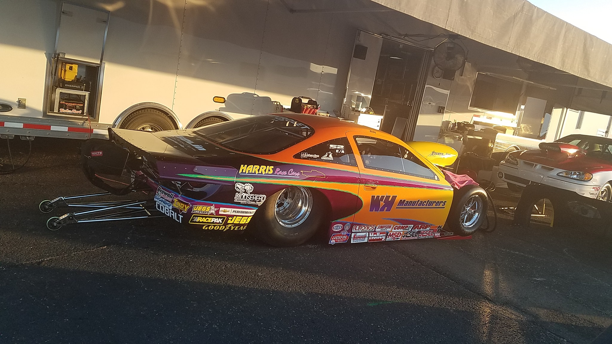

<!DOCTYPE html>
<html lang="en">
<head>
    <meta charset="UTF-8">

    <title>Activity 2 Meg Harris</title>
    <meta name="viewport" content="width=device-width, initial-scale=1.0">
    <link rel="stylesheet" href="https://maxcdn.bootstrapcdn.com/bootstrap/3.3.4/css/bootstrap.min.css">
    <link rel="stylesheet" href="Activity2css.css" type="text/css" media="screen,projection" >
</head>
<body>

 
 

<header>
<h1>Activity 2: Meg Harris</h1>
</header>

 
 
  

      <section>
             
              
              

	I am a CPA (certified public accountant) and Accounting Instructor at 
	UNO. I currently teach introductory and intermediate managerial accounting 
	as well as Accounting Information Systems. Previously, I worked as a CPA in
	a variety of areas including tax, audit, public, private, retail, financial
	services, non-profit, energy, etc. My goal is to obtain a PhD in Information
	Technology/MIS and a tenure track position in the School of Accounting. 
	Additionally, I have two children and a third on the way. 

            

             
             
	    

      </section>
  

             
             
  

      <section>
             
              
	    

	For fun, our family is into drag racing. My husband races a Chevy Cobalt 
	and we are up for a championship this year! Drag racing is sometimes confused with 
	Nascar but in Nascar, the racers drive in circles whereas drag racing is on a straight
	track and is much shorter. The cars use a lot of power and the sport overall requires a
	lot of strategic preparation.
	    

             
             

      </section>
  

             
             
             
             

</body>
</html>

